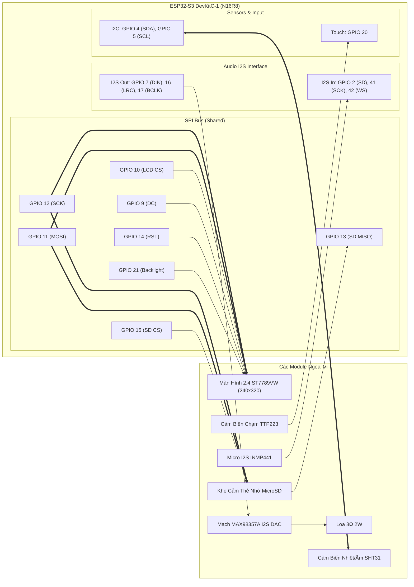

# SƠ ĐỒ ĐẤU NỐI CHÂN PHẦN CỨNG (HARDWARE PINOUT & SCHEMATIC)
## Dự án: Trạm Decor Bàn Làm Việc Thông Minh (ESP32-S3 Freeform Circuit)

---

## 1. Danh sách linh kiện phần cứng

1. **Vi điều khiển**: ESP32-S3 DevKitC-1 (Bản N16R8: 16MB Flash, 8MB Octal PSRAM).
2. **Màn hình & Thẻ nhớ**: Module 2.4" TFT SPI 240x320 V1.3 (ST7789VW) tích hợp khe thẻ MicroSD ở mặt sau.
3. **Bộ khuếch đại âm thanh (I2S DAC)**: MAX98357A.
4. **Loa**: 8Ω 2W (Down-firing hoặc gắn trong ống đồng decor).
5. **Microphone (I2S Mic)**: INMP441 (Micro kỹ thuật số cho XiaoZhi Voice Chat).
6. **Cảm biến môi trường**: SHT31 (Đo nhiệt độ và độ ẩm không khí qua chuẩn I2C).
7. **Cảm biến chạm**: TTP223 (Cảm biến điện dung qua nút đồng / chạm vỏ).

---

## 2. Phương án đấu nối: Dùng chung bus SPI (Shared SPI Bus)

Vì nhu cầu hiển thị là hình nền decor tĩnh, đồng hồ neon và hoạt ảnh mắt XiaoZhi (không phát video băng thông cao), giải pháp **dùng chung đường truyền SPI giữa Màn hình và Thẻ nhớ SD** là tối ưu nhất:
- Tiết kiệm chân GPIO cho ESP32-S3.
- Đường dây đồng thau chạy đối xứng ở cả 2 mép màn hình (mép trái đỡ LCD, mép phải đỡ khe thẻ SD) tạo thành khung giàn chịu lực cực kỳ vững chãi và cân đối.

```
┌─────────────────────────────────────────────────────────────┐
│  [HÀNG 14 CHÂN BÊN TRÁI]               [HÀNG 4 CHÂN BÊN PHẢI]│
│  (Màn hình LCD ST7789VW)                 (Khe Thẻ Nhớ SD)   │
│                                                             │
│  • T_IRQ, T_DO, T_DIN, T_CS, T_CLK       o SD_SCK ───┐      │
│    (5 chân Touch điện trở, KHÔNG DÙNG)   o SD_MISO   │      │
│                                          o SD_MOSI ──┼─┐    │
│  • SDO(MISO) ─ (KHÔNG DÙNG)              o SD_CS     │ │    │
│  • LED       ─ Đèn nền LCD                           │ │    │
│  • SCK       ─ Xung Clock LCD ───────────────────────┘ │    │
│  • SDI(MOSI) ─ Data In LCD ────────────────────────────┘    │
│  • DC        ─ Data / Command                               │
│  • RESET     ─ Reset LCD                                    │
│  • CS        ─ Chip Select LCD                              │
│  • GND       ─ Mass                                         │
│  • VCC       ─ Nguồn 3.3V hoặc 5V                           │
└─────────────────────────────────────────────────────────────┘
```

---

## 3. Bảng phân bổ chân GPIO tổng thể (ESP32-S3 N16R8)

> [!CAUTION]
> **LƯU Ý ĐẶC BIỆT VỀ CHIP ESP32-S3 N16R8:**
> Tuyệt đối **KHÔNG SỬ DỤNG** các chân từ **GPIO 26 đến GPIO 37**! Các chân này được kết nối nội bộ cho 8MB Octal PSRAM và 16MB SPI Flash.

### A. Cụm Màn hình 2.4" ST7789VW & Thẻ nhớ MicroSD (Shared SPI Bus)

| Tên chân trên Bo Màn Hình | Vị trí trên Bo | Nối về ESP32-S3 | Chức năng chi tiết |
| :--- | :--- | :--- | :--- |
| **VCC** | Hàng trái (chân 14) | **5V (hoặc 3.3V)** | Cấp nguồn cho bo màn hình |
| **GND** | Hàng trái (chân 13) | **GND** | Nguồn âm (Mass chung) |
| **CS** | Hàng trái (chân 12) | **GPIO 10** | Chip Select LCD (Kích hoạt màn hình) |
| **RESET** | Hàng trái (chân 11) | **GPIO 14** | Reset phần cứng màn hình |
| **DC** | Hàng trái (chân 10) | **GPIO 9** | Data / Command (Phân biệt lệnh và dữ liệu) |
| **SDI (MOSI)** | Hàng trái (chân 9) | **GPIO 11** | **SPI MOSI CHUNG** (Dữ liệu ra LCD & Thẻ SD) |
| **SCK** | Hàng trái (chân 8) | **GPIO 12** | **SPI SCK CHUNG** (Xung nhịp Clock LCD & Thẻ SD) |
| **LED** | Hàng trái (chân 7) | **GPIO 21** (hoặc 3.3V) | Đèn nền màn hình (có thể băm xung PWM đổi độ sáng) |
| **SDO (MISO)** | Hàng trái (chân 6) | *BỎ TRỐNG (NC)* | Màn hình chỉ nhận dữ liệu, không cần gửi về |
| *5 chân Touch điện trở* | Hàng trái (chân 1-5)| *BỎ TRỐNG (NC)* | T_CLK, T_CS, T_DIN, T_DO, T_IRQ không dùng |
| **SD_SCK** | Hàng 4 chân phải | **GPIO 12** | **Nối chung với SCK màn hình** |
| **SD_MOSI** | Hàng 4 chân phải | **GPIO 11** | **Nối chung với SDI (MOSI) màn hình** |
| **SD_MISO** | Hàng 4 chân phải | **GPIO 13** | Dữ liệu đọc từ Thẻ SD về ESP32 |
| **SD_CS** | Hàng 4 chân phải | **GPIO 15** | Chip Select Thẻ nhớ MicroSD |

---

### B. Cụm Âm thanh I2S (Phát loa MAX98357A & Thu âm Mic INMP441)

| Tên Module | Chân Module | Nối về ESP32-S3 | Ghi chú cấu hình |
| :--- | :--- | :--- | :--- |
| **MAX98357A**<br>*(I2S DAC phát loa)* | **VIN** | **5V (VBUS)** | Cấp nguồn 5V cho âm thanh to và khoẻ |
| | **GND** | **GND** | Nối mass chung |
| | **LRC** | **GPIO 16** | Xung chọn kênh (Word Select - I2S Out) |
| | **BCLK** | **GPIO 17** | Xung nhịp bit (Bit Clock - I2S Out) |
| | **DIN** | **GPIO 7** | Dữ liệu âm thanh số ra loa |
| | **GAIN** | **GND** | Mức khuếch đại chuẩn 9dB (âm trong, không méo) |
| | **SD** | *Bỏ trống hoặc 3.3V* | Mặc định mở kênh (Stereo Mix) |
| **INMP441**<br>*(I2S Mic thu âm)* | **VDD** | **3.3V** | Cấp nguồn 3.3V sạch cho Mic |
| | **GND** | **GND** | Nối mass chung |
| | **WS** | **GPIO 42** | Xung chọn kênh (Word Select - I2S In) |
| | **SCK** | **GPIO 41** | Xung nhịp bit (Bit Clock - I2S In) |
| | **SD** | **GPIO 2** | Dữ liệu âm thanh giọng nói gửi về ESP32 |
| | **L/R** | **GND** | Kênh Trái (Left Channel) |

---

### C. Cụm Cảm biến môi trường SHT31 (I2C) & Cảm biến chạm TTP223

| Linh kiện | Chân Linh Kiện | Nối về ESP32-S3 | Ghi chú |
| :--- | :--- | :--- | :--- |
| **SHT31**<br>*(Nhiệt độ & Độ ẩm)* | **VIN** | **3.3V** | Nguồn 3.3V |
| | **GND** | **GND** | Mass chung |
| | **SDA** | **GPIO 4** | Dữ liệu I2C Data |
| | **SCL** | **GPIO 5** | Xung nhịp I2C Clock |
| **TTP223**<br>*(Cảm biến chạm)* | **VCC** | **3.3V** | Nguồn 3.3V |
| | **GND** | **GND** | Mass chung |
| | **OUT** | **GPIO 20** | Tín hiệu chạm Digital (Mức HIGH khi chạm) |

---

## 4. Sơ đồ khối kiến trúc kết nối (System Diagram)



---

## 5. Kinh nghiệm thi công mạch Freeform Circuit Sculpture

1. **Dây dẫn đồng thau (Brass Wire)**:
   - Dùng thanh đồng thau đường kính **0.8mm hoặc 1.0mm**.
   - Dùng kìm mỏ nhọn uốn các góc vuông 90° sắc cạnh.
2. **Cấu trúc khung đỡ màn hình**:
   - Bên mép trái màn hình: Cụm dây `VCC, GND, CS, RESET, DC, MOSI, SCK, LED` đi xuống hàng chân trái của ESP32.
   - Bên mép phải màn hình: Cụm 4 dây `SD_SCK, SD_MOSI, SD_MISO, SD_CS` đi xuống hàng chân phải của ESP32.
   - Thế đỡ 2 bên này giúp màn hình 2.4 inch tự đứng vững chãi trên đế gỗ mà không cần keo dán hay ốc vít.
3. **Chống nhiễu tín hiệu âm thanh**:
   - Dây GND cho bo âm thanh MAX98357A và INMP441 nên đi một thanh đồng riêng dày dặn trực tiếp về chân GND của nguồn cấp để loại bỏ tiếng xì (hiss) và tiếng rít khi Wi-Fi truyền tải dữ liệu.
4. **Vị trí cảm biến SHT31**:
   - Tránh đặt SHT31 ngay phía trên hoặc sát lưng chip ESP32/màn hình vì nhiệt độ tỏa ra từ phần cứng sẽ làm chỉ số nhiệt độ môi trường bị sai lệch (+2°C đến +4°C). Nên gắn SHT31 trên một trụ cao hoặc nhô ra ngoài đế gỗ.

