# SƠ ĐỒ ĐẤU NỐI CHÂN PHẦN CỨNG CHÍNH THỨC (HARDWARE PINOUT & SCHEMATIC)
## Dự án: Trạm Decor Bàn Làm Việc Thông Minh (ESP32-S3 Freeform Copper Sculpture)
**Phiên bản cấu hình:** Space OS v3.2.0 (Official Hardware Pinout)  
**Ngày cập nhật:** 05/10/2026

---

## 1. Danh sách linh kiện phần cứng tổng thể

1. **Vi điều khiển chính**: ESP32-S3 DevKitC-1 (Phiên bản N16R8: 16MB Flash, 8MB Octal PSRAM).
2. **Màn hình hiển thị**: Màn hình 2.4" TFT IPS SPI 240x320 (ST7789VW) chạy bus SPI tốc độ cao.
3. **Module Thẻ nhớ Micro SD**: Wemos D1 Mini SD Shield cắm áp lưng sau bo mạch ESP32.
4. **Loa Khuếch Đại I2S DAC**: Module MAX98357A (Cổng I2S1 độc lập hoàn toàn, công suất 3W).
5. **Micro Kỹ Thuật Số I2S**: Module INMP441 (Cổng I2S0 độc lập chuyên thu âm AI & XiaoZhi).
6. **Cối xay gió Cyberpunk**: Động cơ giảm tốc N20 và vòng LED cánh cối xay đấu song song qua mạch cầu H L298N Mini / MX1508.
7. **Đèn ống năng lượng sườn trạm**: 2 ống LED Edison filament dẻo 30x6mm ở 2 bên sườn (khung sườn cao 7.7cm), nối tiếp trở hạn dòng $47\,\Omega$, chung GND.
8. **Đèn dải tín hiệu mặt lưng**: 2 thanh LED nước chảy sao băng COB 3V tích hợp IC quét tự động, gắn đối xứng 2 bên dưới module SD, nối trực tiếp vào ESP32.
9. **Cảm biến môi trường**: Module SHT31 (Đo nhiệt độ và độ ẩm qua bus phần cứng I2C).
10. **Cảm biến chạm**: Module điện dung TTP223 (Chạm vào nút đồng / kết cấu kim loại decor).
11. **Bo nguồn & Bàn phím**: Keypad_Power_Shield (7 phím điều hướng thang trở 1 dây, IC sạc pin TP4056 và mạch tăng áp 5V nuôi hệ thống).
12. **Đèn RGB Onboard**: WS2812 NeoPixel có sẵn trên kit ESP32-S3 (GPIO 48).

---

> [!CAUTION]
> **LƯU Ý ĐẶC BIỆT VỀ CHIP ESP32-S3 N16R8:**
> Tuyệt đối **KHÔNG SỬ DỤNG** các chân từ **GPIO 26 đến GPIO 37**! Các chân này được kết nối nội bộ cho 8MB Octal PSRAM và 16MB SPI Flash. Chân **GPIO 46** là chân *Input-Only* (chỉ nhận tín hiệu vào, không thể xuất HIGH/LOW).

---

## 2. Bảng phân bổ chân theo 2 hàng cắm vật lý (ESP32-S3 DevKitC-1)

Sơ đồ nhìn từ mặt trước khi cổng USB hướng lên trên:

### Hàng chân bên TRÁI (Header J1)

| Thứ tự | Ký hiệu Pin | GPIO | Kết nối ngoại vi | Chức năng chi tiết |
| :---: | :--- | :---: | :--- | :--- |
| 1 | 3V3 | - | Nguồn 3.3V | Cấp nguồn cho SHT31, TTP223, Mic INMP441 |
| 2 | 3V3 | - | Nguồn 3.3V | Dự phòng cấp nguồn |
| 3 | EN / RST | - | Nút Reset MCU | Nối nút reset cứng nếu cần |
| 4 | GPIO 4 | **4** | **Mic INMP441 SCK** | Xung nhịp bit thu âm (I2S0 BCLK) |
| 5 | GPIO 5 | **5** | **Mic INMP441 WS** | Xung chọn kênh thu âm (I2S0 WS / LRC) |
| 6 | GPIO 6 | **6** | **Mic INMP441 SD** | Dữ liệu giọng nói gửi về ESP32 (I2S0 Data IN) |
| 7 | GPIO 7 | **7** | **Màn hình ST7789 BLK** | Đèn nền LCD (Điều chỉnh độ sáng PWM 0..100%) |
| 8 | GPIO 15 | **15** | **Loa MAX98357A DIN** | **Dữ liệu âm thanh số ra loa (I2S1 Data OUT)** |
| 9 | GPIO 16 | **16** | **Loa MAX98357A BCLK** | **Xung nhịp bit phát loa (I2S1 Bit Clock)** |
| 10 | GPIO 17 | **17** | **Loa MAX98357A LRC** | **Xung chọn kênh phát loa (I2S1 Word Select)** |
| 11 | GPIO 18 | **18** | **LED Nước Chảy Trái (L)** | **Cực (+) Thanh LED sao băng bên trái mặt lưng (ESP32)** |
| 12 | GPIO 8 | **8** | **Cảm biến SHT31 SDA** | Dữ liệu I2C Data |
| 13 | GPIO 19 | 19 | USB D- | Dành riêng Native USB (Tránh dùng) |
| 14 | GPIO 20 | **20** | **Cảm biến Chạm TTP223** | Tín hiệu chạm Digital SIG (Active HIGH) |
| 15 | GPIO 3 | **3** | **Bàn phím KEY_ADC** | Đọc cụm thang điện trở 7 nút (ADC1_CH2) |
| 16 | GPIO 46 | **46** | **Bo Sạc CHG_STAT** | Đọc cờ trạng thái sạc pin TP4056 (Input-Only) |
| 17 | GPIO 9 | **9** | **Cảm biến SHT31 SCL** | Xung nhịp I2C Clock |
| 18 | GPIO 10 | **10** | **Màn hình ST7789 RST** | Reset phần cứng LCD |
| 19 | GPIO 11 | **11** | **Màn hình ST7789 MOSI** | SPI Data Out (SDA / SDI) |
| 20 | GPIO 12 | **12** | **Màn hình ST7789 SCK** | SPI Clock (SCL) |
| 21 | GPIO 13 | **13** | **Màn hình ST7789 DC** | SPI Data / Command |
| 22 | GPIO 14 | **14** | **Màn hình ST7789 CS** | SPI Chip Select LCD |

---

### Hàng chân bên PHẢI (Header J3)

| Thứ tự | Ký hiệu Pin | GPIO | Kết nối ngoại vi | Chức năng chi tiết |
| :---: | :--- | :---: | :--- | :--- |
| 1 | GND | - | Mass chung | Khung sườn đồng 1.2mm |
| 2 | GPIO 43 | 43 | UART0 TXD | Serial Monitor / Nạp code (CH343) |
| 3 | GPIO 44 | 44 | UART0 RXD | Serial Monitor / Nạp code (CH343) |
| 4 | GPIO 1 | **1** | **Cối Xay Gió IN1** | PWM điều tốc Motor N20 & Vành đèn cánh cối xay |
| 5 | GPIO 2 | **2** | **2 LED Ống Edison Sườn** | Cực (+) 2 ống LED Edison 30mm qua trở $47\,\Omega$ (hoặc L298N IN3) |
| 6 | GPIO 42 | **42** | **Thẻ Micro SD SCK** | SPI Clock thẻ nhớ SD |
| 7 | GPIO 41 | **41** | **Thẻ Micro SD MISO** | SPI Data In từ thẻ nhớ SD về ESP32 |
| 8 | GPIO 40 | **40** | **Thẻ Micro SD MOSI** | SPI Data Out từ ESP32 ghi vào thẻ nhớ SD |
| 9 | GPIO 39 | **39** | **Thẻ Micro SD CS** | Chip Select thẻ nhớ SD |
| 10 | GPIO 38 | **38** | **LED Nước Chảy Phải (R)** | **Cực (+) Thanh LED sao băng bên phải mặt lưng (ESP32)** |
| 11-13 | GPIO 35-37 | - | *BỎ TRỐNG* | **CẤM DÙNG** (Nội bộ Octal PSRAM / SPI Flash) |
| 14 | GPIO 0 | 0 | Boot Pin | Để hở / Nút BOOT |
| 15 | GPIO 45 | 45 | Dự phòng | Chân I/O tự do |
| 16 | GPIO 48 | **48** | **RGB WS2812 Onboard** | Đèn LED đa sắc RGB tích hợp sẵn trên mạch |
| 17 | GPIO 47 | 47 | Dự phòng | Chân I/O tự do |
| 18 | GPIO 21 | 21 | Dự phòng / BAT_ADC 2 | Dự phòng đọc điện áp pin hoặc LED phụ |
| 19 | NC / GND | - | Mass chung | - |
| 20 | GND | - | Mass chung | Nối sườn trạm kiềng đồng |
| 21 | 5V | - | Nguồn VIN 5V | Nhận nguồn 5V từ cổng Type-C hoặc bo sạc pin |
| 22 | GND | - | Mass chung | Nối mass chung hệ thống |

---

## 3. Chi tiết các cụm ngoại vi đặc biệt

### A. Hệ thống Âm thanh Kép I2S (MAX98357A & INMP441 Độc Lập)
Việc tách riêng biệt cụm chân I2S cho Loa và Mic giúp ESP32-S3 chạy **Full Duplex** (vừa thu âm vừa phát loa cùng lúc, sample rate độc lập hoàn toàn):
- **Cụm Thu Âm Mic INMP441 (I2S0)**:
  - `BCLK`: GPIO 4
  - `WS`  : GPIO 5
  - `SD`  : GPIO 6
  - `L/R` : Nối GND (Kênh Trái Mono)
- **Cụm Phát Loa MAX98357A DAC (I2S1)**:
  - `DIN` : GPIO 15
  - `BCLK`: GPIO 16
  - `LRC` : GPIO 17
  - `GAIN`: Nối GND (Mức khuếch đại chuẩn 9dB, âm trong trẻo, không vỡ tiếng)
  - `SD_MODE`: Thả nổi hoặc nối 3.3V (Kích hoạt stereo mix)
  - *Ưu điểm layout*: Ba chân **15 - 16 - 17** nằm liên tiếp nhau trên hàng chân trái, cắm jumper thẳng 1 hàng không bị chéo dây.

---

### B. Cụm Đèn Decor Trạm Không Gian
1. **2 Ống LED Edison $30\,\text{mm}$ ở 2 mặt bên sườn ($7.7\,\text{cm}$)**:
   - Nối chung GND vào khung sườn đồng.
   - Cực dương (+) mỗi ống nối qua 1 điện trở hạn dòng $47\,\Omega$.
   - Điều khiển băm xung PWM mượt mà trên **`GPIO 2`** (dòng chỉ $\approx 10.6\,\text{mA}$ mỗi ống, an toàn tuyệt đối khi nuôi trực tiếp từ ESP32 hoặc qua kênh L298N IN3).
   - Dây cấp cực (+) sử dụng dây đồng tráng men cách điện $0.1\,\text{mm}$ dán ẩn sau thanh đồng $1.2\,\text{mm}$.
2. **2 Thanh LED nước chảy sao băng mặt lưng (COB 3V tích hợp IC quét)**:
   - Vị trí: Đặt đối xứng hai bên bên dưới khe thẻ Micro SD ở mặt lưng trạm.
   - Nối chung GND vào khung đồng.
   - Thanh bên Trái: Cực (+) nối trực tiếp vào **`GPIO 18`** (khoảng cách chỉ $1-2\,\text{cm}$).
   - Thanh bên Phải: Cực (+) nối trực tiếp vào **`GPIO 38`** (khoảng cách chỉ $1-2\,\text{cm}$).
   - Không cần kéo dây xuống L298N ở chân tháp cối xay, loại bỏ hoàn toàn tình trạng rối dây!

---

### C. Cối xay gió Cyberpunk N20
- Động cơ N20 và vành đèn LED trên cánh cối xay đã được đấu song song vào ngõ ra OUT1 của module L298N Mini / MX1508.
- Chân điều khiển: Duy nhất **`GPIO 1`** nối vào IN1 (PWM tần số cao 5000Hz).
- Toàn bộ dây từ ESP32 xuống mạch cối xay ở chân tháp chỉ còn duy nhất **1 đường tín hiệu GPIO 1** và đường nguồn.

---

### D. Bo Nguồn & Bàn Phím Keypad_Power_Shield
- **`GPIO 3` (KEY_ADC)**: Đọc thang điện trở 7 phím bấm (Up, Down, Left, Right, OK, Menu, Exit) với 1 dây tín hiệu duy nhất kết hợp trở kéo lên $10\,\text{k}\Omega$ lên 3.3V.
- **`GPIO 46` (CHG_STAT)**: Đọc trạng thái sạc pin từ chân STAT của IC TP4056 (mức LOW khi đang sạc, HIGH/thả nổi khi sạc đầy). Chân GPIO 46 là chân Input-Only chuyên dụng nên cực kỳ phù hợp.
- **`GPIO 2` / `GPIO 21` (BAT_ADC)**: Dự phòng đọc điện áp pin Lithium 18650 qua cầu phân áp $100\,\text{k}\Omega / 100\,\text{k}\Omega$.

---

## 4. Sơ đồ khối kiến trúc phần cứng (Hardware Architecture)

```mermaid
flowchart TD
    subgraph ESP32["ESP32-S3 DevKitC-1 (N16R8)"]
        direction TB

        subgraph SPI_LCD["Màn Hình SPI ST7789 (2.4 inch)"]
            TFT_MOSI["GPIO 11 (MOSI)"]
            TFT_SCK["GPIO 12 (SCK)"]
            TFT_DC["GPIO 13 (DC)"]
            TFT_CS["GPIO 14 (CS)"]
            TFT_RST["GPIO 10 (RST)"]
            TFT_BL["GPIO 7 (PWM Backlight)"]
        end

        subgraph SPI_SD["Thẻ Nhớ Micro SD (Shield Mặt Sau)"]
            SD_MOSI["GPIO 40 (MOSI)"]
            SD_MISO["GPIO 41 (MISO)"]
            SD_SCK["GPIO 42 (SCK)"]
            SD_CS["GPIO 39 (CS)"]
        end

        subgraph AUDIO_DUAL["Âm Thanh Kép Độc Lập"]
            I2S1_LOA["I2S1 Loa MAX98357A:\nDIN (15), BCLK (16), LRC (17)"]
            I2S0_MIC["I2S0 Mic INMP441:\nSCK (4), WS (5), SD (6)"]
        end

        subgraph DECOR_LIGHTS["Cối Xay & Đèn Decor"]
            WINDMILL["GPIO 1 (PWM): Motor N20 & Vành LED (L298N IN1)"]
            EDISON["GPIO 2 (PWM): 2 LED Ống Edison Sườn 30mm (Trở 47Ω)"]
            FLOW_L["GPIO 18: Thanh LED Nước Chảy Lưng Trái"]
            FLOW_R["GPIO 38: Thanh LED Nước Chảy Lưng Phải"]
        end

        subgraph SENSORS_INPUT["Cảm Biến & Bàn Phím"]
            I2C_SHT["GPIO 8 (SDA), GPIO 9 (SCL): Cảm Biến SHT31"]
            TOUCH_PAD["GPIO 20: Cảm Biến Chạm Điện Dung TTP223"]
            KEYPAD_IN["GPIO 3 (ADC1_CH2): Bàn Phím 7 Nút 1 Dây"]
            CHG_IN["GPIO 46 (Input-Only): Báo Trạng Thái Sạc Pin TP4056"]
            RGB_ON["GPIO 48: WS2812 RGB Onboard"]
        end
    end

    subgraph HARDWARE_MODULES["Khối Linh Kiện Ngoại Vi"]
        ST7789["Màn hình 2.4 IPS ST7789"]
        MICRO_SD["Thẻ Micro SD FAT32"]
        MAX98357["Loa 3W qua MAX98357A DAC"]
        INMP441_DEV["Micro số INMP441"]
        L298N_DEV["Module Cầu H L298N / MX1508"]
        MOTOR_FAN["Động cơ Cối Xay N20 + LED Vòng"]
        TUBE_EDISON["2 Ống LED Edison 30mm (Sườn 7.7cm)"]
        FLOW_STRIPS["2 Thanh LED Nước Chảy Sao Băng (Mặt Lưng)"]
        SHT31_DEV["Cảm Biến Nhiệt/Ẩm SHT31"]
        TTP223_DEV["Phím Chạm TTP223 Vỏ Đồng"]
        KEY_BOARD["Bo Keypad 7 Phím & Pin 18650"]
    end

    SPI_LCD ==> ST7789
    SPI_SD ==> MICRO_SD
    I2S1_LOA --> MAX98357
    INMP441_DEV --> I2S0_MIC
    WINDMILL --> L298N_DEV --> MOTOR_FAN
    EDISON --> TUBE_EDISON
    FLOW_L --> FLOW_STRIPS
    FLOW_R --> FLOW_STRIPS
    I2C_SHT <===> SHT31_DEV
    TTP223_DEV --> TOUCH_PAD
    KEY_BOARD --> KEYPAD_IN
    KEY_BOARD --> CHG_IN
```

---

## 5. Kinh nghiệm thi công mạch Freeform Circuit Sculpture

1. **Khung sườn chịu lực và đường Mass (GND)**:
   - Dùng thanh đồng nguyên khối đường kính **$1.2\,\text{mm}$**.
   - Toàn bộ cực âm (GND) của màn hình, thẻ nhớ, LED Edison, LED nước chảy, cảm biến và module âm thanh đều được hàn trực tiếp vào khung sườn đồng này để tạo mặt phẳng tiếp địa vững chắc và giải nhiệt cho linh kiện.
2. **Kỹ thuật giấu dây tàng hình**:
   - Dùng dây đồng tráng men cách điện đường kính siêu nhỏ **$0.1\,\text{mm}$** (dây quấn biến áp).
   - Luồn hoặc dán áp sát sợi dây $0.1\,\text{mm}$ vào mặt sau của thanh đồng $1.2\,\text{mm}$. Dưới góc nhìn trực diện, người xem chỉ thấy các thanh đồng uốn lượn phong cách Cyberpunk mà không hề thấy dây điện.
3. **Chống nhiễu I2S & nguồn sụt áp**:
   - Chân nguồn 5V của MAX98357A nên lấy từ chân VBUS/5V của ESP32 và có tụ hóa $100\,\mu\text{F} - 220\,\mu\text{F}$ lọc nguồn tại chỗ để âm bass căng và không gây sập cổng USB.
   - Ba dây I2S của MAX98357A (GPIO 15, 16, 17) và ba dây Mic INMP441 (GPIO 4, 5, 6) chạy theo 2 hướng khác nhau, tránh song song sát nhau để tránh hiện tượng dội âm (acoustic echo).

