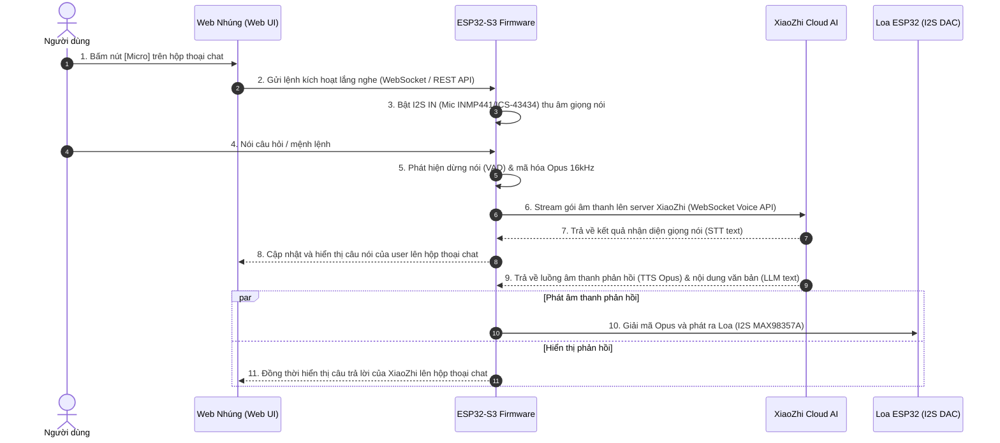

# DIY Decor ESP32
## Tài liệu định hướng dự án

## 1. Mục tiêu dự án

Dự án này là một thiết bị DIY decor dùng ESP32, hướng tới một màn hình để bàn có tính trang trí và thông tin. Ở giai đoạn hiện tại, dự án **chưa có board phần cứng thật đầy đủ**, nên toàn bộ quá trình sẽ **mô phỏng trên Wokwi trước** để kiểm tra giao diện, luồng xử lý và logic chức năng.

Mục tiêu trước mắt là xây dựng một nguyên mẫu chạy ổn định, đủ để:
- hiển thị ảnh và trạng thái lên màn hình
- chạy web server để tải ảnh
- mô phỏng các chế độ hiển thị cơ bản
- chuẩn bị khung kiến trúc cho phiên bản phần cứng thật sau này

## 2. Tình trạng hiện tại

### 2.1 Giai đoạn phát triển
- Chưa có board thật / module thật hoàn chỉnh
- Chạy mô phỏng trên Wokwi
- Ưu tiên kiểm tra luồng logic hơn là tối ưu phần cứng

### 2.2 Phạm vi đang làm
- Web server upload ảnh
- Xử lý và nén ảnh xuống khoảng 200–300 KB
- Màn hình chờ có hiển thị thời gian
- Màn hình trạng thái PC
- Màn hình emoji biểu cảm trạng thái

## 3. Chức năng cốt lõi

### 3.1 Web server tải ảnh
Thiết bị chạy một web server đơn giản để người dùng có thể:
- truy cập bằng trình duyệt
- tải ảnh lên thiết bị
- thay đổi nội dung hiển thị mà không cần nạp lại firmware

### 3.2 Nén ảnh đầu vào
Ảnh tải lên sẽ được xử lý để giảm dung lượng xuống khoảng **200–300 KB** nhằm:
- phù hợp giới hạn bộ nhớ
- giảm tải khi lưu trữ và hiển thị
- đảm bảo chạy ổn định trên mô phỏng và sau này là phần cứng thật

### 3.3 Màn hình chờ có thời gian
Thiết kế màn hình standby dùng khi thiết bị không có tương tác, gồm:
- đồng hồ / thời gian hiện tại
- bố cục gọn, giống một thiết bị để bàn
- có thể mở rộng thêm ngày tháng hoặc thông tin phụ sau này

### 3.4 Màn hình trạng thái PC
Thiết kế một màn hình hiển thị trạng thái PC theo dạng HUD đơn giản.

Trong giai đoạn mô phỏng:
- dữ liệu có thể là giả lập
- hoặc nhập tay để test giao diện
- chưa cần kết nối phần mềm PC thật

### 3.5 Màn hình biểu cảm emoji
Thiết kế bộ biểu cảm trạng thái theo phong cách đơn giản, lấy cảm hứng từ kiểu biểu cảm như XiaoZhi.

Các trạng thái cần có:
- Idle
- Liếc mắt trái
- Liếc mắt phải
- Nháy 2 mắt
- Giận
- Bối rối (@@)

## 4. Hướng triển khai trong Wokwi

Vì chưa có phần cứng thật, cách làm hợp lý nhất là chia dự án thành các phần mô phỏng nhỏ:

1. **Khởi tạo màn hình cơ bản**
   - vẽ layout
   - hiển thị trạng thái mặc định

2. **Tạo state machine cho màn hình**
   - chuyển giữa standby, PC status, emoji mode
   - đảm bảo trạng thái không bị rối

3. **Dựng web server**
   - phục vụ giao diện upload ảnh
   - nhận request từ trình duyệt

4. **Xử lý ảnh**
   - nhận file ảnh
   - nén ảnh về dung lượng mục tiêu
   - chuẩn bị cho bước hiển thị lên màn hình

5. **Mô phỏng dữ liệu PC**
   - dựng dữ liệu giả cho CPU, RAM, nhiệt độ
   - dùng để kiểm tra layout HUD

6. **Hoàn thiện bộ emoji**
   - xây dựng từng biểu cảm riêng
   - đảm bảo chuyển đổi mượt, dễ mở rộng

## 5. Mục tiêu ngắn hạn

Trong giai đoạn đầu, ưu tiên các mục tiêu sau:
- chạy được trên Wokwi ổn định
- web server hoạt động được
- upload ảnh thành công
- ảnh được nén đúng mục tiêu dung lượng
- màn hình chờ hiển thị thời gian
- màn hình PC status hiển thị dữ liệu mô phỏng
- emoji trạng thái chuyển được giữa các biểu cảm

## 6. Định hướng sau này (Roadmap & Tính năng mở rộng)

Khi chuyển sang phần cứng thật đầy đủ (ESP32-S3 N16R8, màn hình TFT/OLED, microphone I2S, loa DAC I2S):
- Đồng bộ thời gian qua Internet (NTP Server).
- Lưu ảnh và cấu hình lâu dài trên bộ nhớ ngoài (Flash LittleFS / thẻ nhớ SD).
- Kết nối đồng bộ trạng thái PC thật qua phần mềm giám sát.
- Mở rộng thành một thiết bị decor để bàn thông minh và tương tác hoàn chỉnh.

### 6.1 Bố cục Màn hình Biểu Cảm XiaoZhi (Chia 2 phần: Biểu Cảm & Phụ Đề 2-3 Dòng)
Màn hình dọc 240x320 được phân chia thành 2 khu vực chức năng trực quan:
1. **Phần trên (Chiếm ~70% chiều cao - Emoji Eyes Stage)**:
   - Dành riêng cho đôi mắt biểu cảm sinh động (Neon Cyan, Amber, Rose Red).
   - Chuyển động liếc nhìn 4 hướng (Trái, Phải, Lên, Xuống), nháy mắt đơn, chớp mắt kép và các trạng thái cảm xúc (Vui vẻ, Giận dữ, Bối rối, Ngái ngủ, Lắng nghe).
2. **Phần dưới (Chiếm ~30% chiều cao - Subtitle / Text Box 2-3 dòng chữ)**:
   - Khung viền bán trong suốt công nghệ cao (Frosted Glass).
   - Hiển thị văn bản phụ đề phản hồi thời gian thực của XiaoZhi trả về từ Cloud (hoặc câu lệnh vừa thu âm từ người dùng).
   - Font chữ rõ nét, giới hạn vừa vặn 2-3 dòng chữ giúp trạm decor vừa sinh động vừa truyền tải thông điệp nhanh chóng mà không che mất đôi mắt biểu cảm.

### 6.2 Các Tiện ích Để Bàn Mở Rộng (Desktop Smart Utilities)
Bên cạnh chức năng đồng hồ chờ và trợ lý AI XiaoZhi, thiết bị sẽ mở rộng thêm cụm tiện ích thời gian hữu dụng:
1. **Đồng hồ bấm giờ (Stopwatch)**:
   - Đo thời gian chính xác từng phần trăm giây (hh:mm:ss.ms).
   - Hỗ trợ nút Bắt đầu, Tạm dừng, Ghi vòng (Lap) và Đặt lại (Reset) trực tiếp từ phím bấm hoặc giao diện Web.
2. **Báo thức thông minh (Smart Alarm Clock)**:
   - Cài đặt nhiều mốc giờ báo thức lặp lại theo ngày trong tuần qua Web.
   - Khi đến giờ, phát chuông báo qua chip I2S DAC MAX98357A và nhấp nháy đèn LED góc màn hình kèm biểu cảm gọi dậy.
   - Hỗ trợ tính năng báo lại (Snooze) qua cảm biến chạm TTP223.
3. **Hẹn giờ đếm ngược & Pomodoro (Countdown Timer & Productivity)**:
   - Đặt thời gian đếm ngược (nấu ăn, giải lao, tập trung làm việc 25 phút Pomodoro).
   - Mắt XiaoZhi chuyển sang trạng thái tập trung làm việc, hết giờ phát chuông thông báo và nháy mắt chúc mừng.

### 6.3 Kiến trúc Tương tác Giọng nói XiaoZhi AI (Voice Chat Pipeline)

Hệ thống sẽ kết hợp nhịp nhàng giữa giao diện Web nhúng (Web UI) và phần cứng ESP32-S3 để thực hiện chu trình đàm thoại AI thông minh hai chiều:

#### Chi tiết quy trình xử lý 5 bước:
1. **Nút Micro trên Web Nhúng**:
   - Trên thanh nhập tin nhắn của Web nhúng (`chat-input-bar`), trang bị nút bấm biểu tượng Micro (`🎙️`).
   - Khi người dùng bấm vào nút Mic, giao diện chuyển sang trạng thái đang ghi nhận (hiệu ứng sóng âm động).
2. **Kích hoạt chế độ lắng nghe trên ESP32**:
   - Web nhúng gửi lệnh điều khiển tới ESP32 thông qua kênh WebSocket nội bộ hoặc REST API (`/api/audio/listen`).
   - ESP32 kích hoạt bộ điều khiển ngoại vi I2S thu âm (kết nối Module Microphone kỹ thuật số như INMP441, ICS-43434 hoặc ES8388 codec).
   - Màn hình decor tự động chuyển sang biểu cảm lắng nghe (`Listening...`).
3. **Thu âm, Nén Opus và Gửi lên XiaoZhi Cloud**:
   - ESP32 thu tín hiệu âm thanh mẫu chuẩn 16kHz, 16-bit Mono.
   - Xử lý phát hiện ngưng giọng (VAD - Voice Activity Detection) hoặc kết thúc theo thời gian/thao tác người dùng.
   - Mã hóa luồng âm thanh sang định dạng Opus (frame 60ms) và stream trực tiếp lên cổng âm thanh của XiaoZhi Cloud qua kết nối WebSocket bảo mật (WSS).
4. **Nhận diện giọng nói và Phản hồi trên Hộp thoại Web (Speech-to-Text)**:
   - XiaoZhi Cloud xử lý nhận diện giọng nói và trả về bản tin văn bản (STT).
   - ESP32 nhận bản tin này và lập tức chuyển tiếp (forward) về Web nhúng qua WebSocket.
   - Giao diện Web tự động thêm bong bóng chat của người dùng hiển thị văn bản vừa được nói.
5. **Phát âm thanh ra loa và Hiển thị câu trả lời của XiaoZhi**:
   - XiaoZhi Cloud trả về đồng thời:
     - **Dữ liệu văn bản (LLM text response)**: Gửi về Web nhúng để hiển thị câu trả lời của XiaoZhi trong hộp thoại chat.
     - **Dữ liệu âm thanh (TTS Opus)**: Stream về ESP32 để giải mã sang PCM và xuất ra loa thông qua mạch khuếch đại công suất I2S DAC (MAX98357A / ES8388).
   - Màn hình decor hiển thị biểu cảm cử động miệng/nói chuyện (`Speaking...`) khớp với thời lượng âm thanh phát ra loa.

## 7. Tài liệu kỹ thuật liên quan

- Sơ đồ nối chân phần cứng chi tiết: [PINOUT.md](file:///c:/Users/admin/Documents/GitHub/Decor_Esp32/PINOUT.md) (Quy hoạch chân ESP32-S3 N16R8, màn hình ST7789VW, thẻ MicroSD chung bus SPI, I2S MAX98357A, I2S INMP441, SHT31, TTP223).
- Tài liệu này được cập nhật bám sát tiến độ dự án: hoàn thiện giao diện Web và các màn hình decor mô phỏng trước, sau đó tích hợp phần cứng âm thanh I2S và kết nối Voice XiaoZhi Cloud toàn diện.